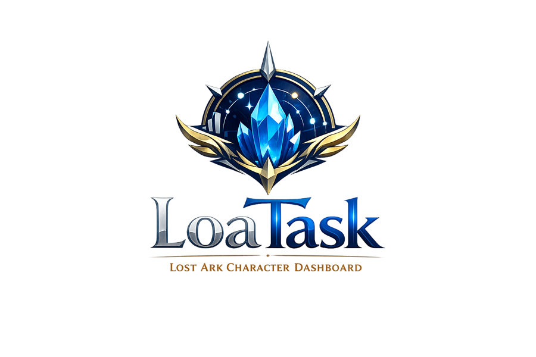

  

# LoaTask

로스트아크 Open API를 활용하여 캐릭터 정보를 조회하고, 조회한 캐릭터 데이터를 저장·관리하는 Spring Boot 기반 백엔드 프로젝트입니다.

Vue.js와 연동하여 캐릭터 카드, 원정대 정보, 아이템 레벨, 길드 정보 등을 보여주는 대시보드 형태로 확장, 그리고 또 다른 부가 기능들을 추가 개발하는 것을 목표로 합니다.

## 프로젝트 목적

이 프로젝트는 Vue.js와 Spring Boot 기반의 풀스택 개발 감각을 유지하고, 외부 API 연동부터 데이터 저장, 조회, 수정, 삭제까지 백엔드 기본 흐름을 실습하기 위해 진행했습니다.

- Spring Boot 기반 REST API 개발
- MySQL과 JPA를 활용한 데이터 저장
- 로스트아크 Open API 연동
- 외부 API 응답 DTO 매핑
- 캐릭터 정보 CRUD 기능 구현
- Vue.js를 이용, 화면 UI 구현

## 기술 스택

### Backend

- Java
- Spring Boot
- Spring Web
- Spring Data JPA
- MySQL
- Lombok
- RestClient

### Frontend

- Vue.js
- Axios
- Vuetify 

### Tools

- IntelliJ IDEA
- MySQL Workbench
- Git / GitHub
- Lost Ark Open API

## 주요 기능

### 구현 완료

- 로스트아크 프로젝트 상태 확인 API
- 캐릭터 등록 API
- 캐릭터 목록 조회 API
- 캐릭터 상세 조회 API
- 캐릭터 수정 API
- 캐릭터 삭제 API
- 로스트아크 공식 API 캐릭터 프로필 조회
- 공식 API로 조회한 캐릭터 정보를 DB에 저장하는 기능

### 구현 예정

- Vue.js 캐릭터 목록 화면
- 캐릭터 카드 UI
- 캐릭터 검색 기능
- 주간 숙제 체크 기능
- 캐릭터별 예상 골드 계산 기능
- 원정대 대시보드
- 지속적으로 추가 기능 개발 예정
